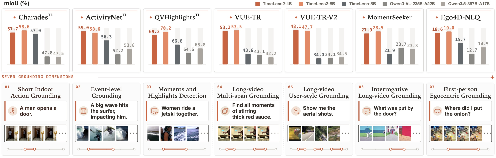

  

  
  

  <a href="#overview">Overview</a> ·
  <a href="#models-and-data">Models and data</a> ·
  <a href="#codebase">Codebase</a> ·
  <a href="#reproduction">Reproduction</a>

<strong>Find the moments that matter.</strong> 
TimeLens2 turns natural-language queries into precise, traceable evidence intervals on the video timeline.

  
   One model family across seven temporal-grounding settings, from short indoor actions to long-form and egocentric video.

---

## Overview

TimeLens2 is a generalist video temporal-grounding MLLM. Given a video and a natural-language description or question, it finds
**when the supporting visual evidence occurs** and returns one or more temporal
intervals. A single model handles short and long videos, single and repeated
events, descriptive and question-form queries, and both third-person and
egocentric footage through a unified generative interface.

| Scope | Training | Output |
| :--- | :--- | :--- |
| Short and long videos · third-person and egocentric footage | Verified SFT data · temporal-grounding GRPO | One or more precise temporal intervals |

TimeLens2 treats temporal evidence as a **set of intervals** throughout training.
Its supervised stage uses verified single- and multi-span annotations from
TimeLens2-93K. Its GRPO stage combines temporal IoU with a matching-free temporal
Wasserstein reward. The SFT, GRPO, and evaluation code are released in this
repository.

## Models and data

| Resource | Type | Description |
| :--- | :--- | :--- |
| [TimeLens2-4B](https://huggingface.co/MCG-NJU/TimeLens2-4B) | Model | Compact TimeLens2 checkpoint based on the 4B backbone |
| [TimeLens2-8B](https://huggingface.co/MCG-NJU/TimeLens2-8B) | Model | Higher-capacity TimeLens2 checkpoint based on the 8B backbone |
| [TimeLens2-93K](https://huggingface.co/datasets/MCG-NJU/TimeLens2-93K) | Dataset | 23,793 videos · 93,232 temporal-grounding pairs |

The repository includes the ready-to-use annotations and rollout data used by
the provided SFT and GRPO recipes. Video files are distributed separately through
the linked Hugging Face dataset and must be downloaded before training. To use
another framework for SFT or RL, download the public data and convert it to that
framework's required format.

## Codebase

The official training and evaluation code is organized around the three stages
used in the project:

| Stage | Purpose | Guide | Main entry points |
| :--- | :--- | :--- | :--- |
| `sft/` | XTuner-based supervised fine-tuning | [SFT guide](sft/README.md) | [`train_sft_4b.sh`](sft/scripts/train_sft_4b.sh) · [`train_sft_8b.sh`](sft/scripts/train_sft_8b.sh) |
| `grpo/` | Off-policy rollout and GRPO | [GRPO guide](grpo/README.md) | [`rollout_timelens2.sh`](grpo/scripts/rollout_timelens2.sh) · [`train_grpo_4b.sh`](grpo/scripts/train_grpo_4b.sh) · [`train_grpo_8b.sh`](grpo/scripts/train_grpo_8b.sh) |
| `evaluation/` | VLMEvalKit with the TimeLens2 grounding entry | [Evaluation guide](evaluation/README.md) | [`run_grounding.sh`](evaluation/scripts/srun_eval_all/run_grounding.sh) |

## Reproduction

1. **Prepare the videos.** Download TimeLens2-93K, TimeLens-100K, and
   Ego4D-NLQ. The SFT and GRPO annotations are already included in this repository.
2. **Run supervised fine-tuning.** Launch
   [`train_sft_4b.sh`](sft/scripts/train_sft_4b.sh) or
   [`train_sft_8b.sh`](sft/scripts/train_sft_8b.sh).
3. **Prepare rollouts.** Use the bundled results, or regenerate them with
   [`rollout_timelens2.sh`](grpo/scripts/rollout_timelens2.sh). Its single
   configuration includes both `timelens2-93k` and `timelens-100k`.
4. **Run GRPO.** Launch [`train_grpo_4b.sh`](grpo/scripts/train_grpo_4b.sh) or
   [`train_grpo_8b.sh`](grpo/scripts/train_grpo_8b.sh). Both default to the
   bundled official rollout files for both sources.
5. **Evaluate.** Run
   [`run_grounding.sh`](evaluation/scripts/srun_eval_all/run_grounding.sh).

Each module has a focused README with installation, data layout, environment
variables, and launch examples. Paths are configurable and may contain
environment variables.

## License and acknowledgements

The project is released under the Apache License 2.0. The SFT, evaluation, and
GRPO modules contain code derived from [InternLM/xtuner](https://github.com/InternLM/xtuner),
[open-compass/VLMEvalKit](https://github.com/open-compass/VLMEvalKit), and
[TencentARC/TimeLens](https://github.com/TencentARC/TimeLens), respectively. We
thank their authors for open-sourcing these projects.
